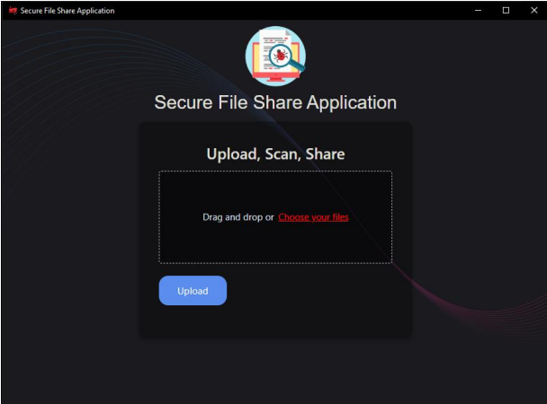
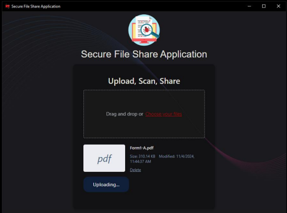
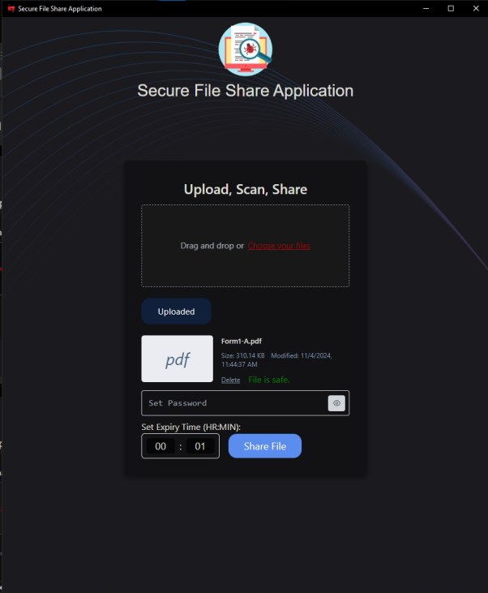
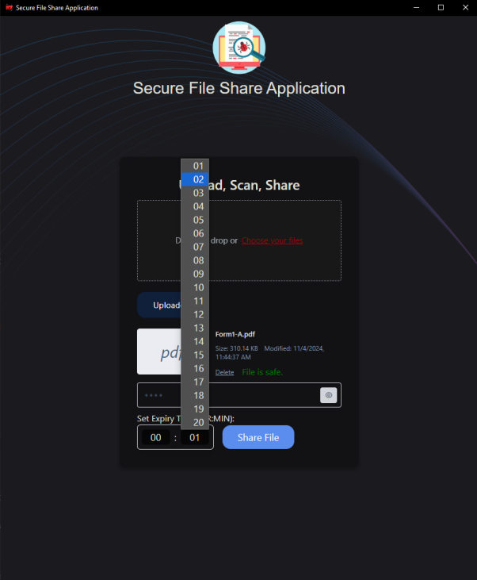
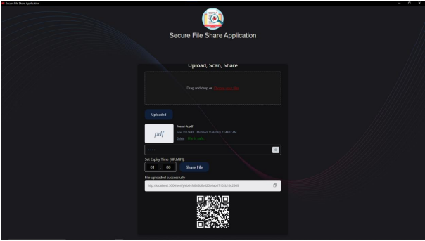
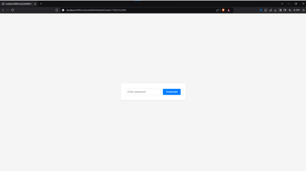
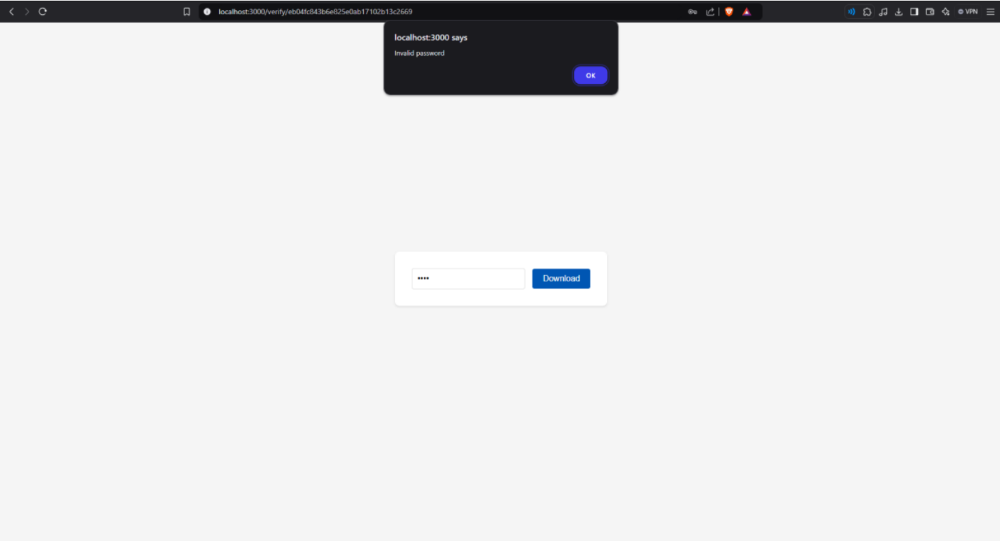
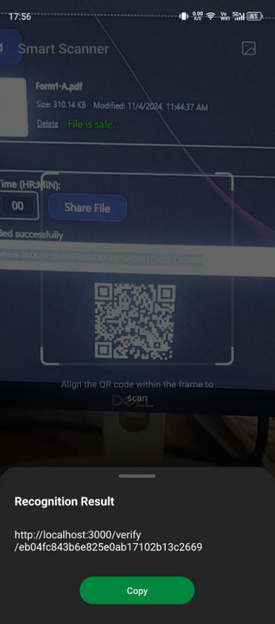
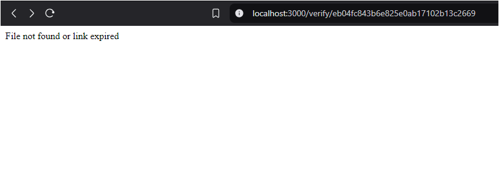
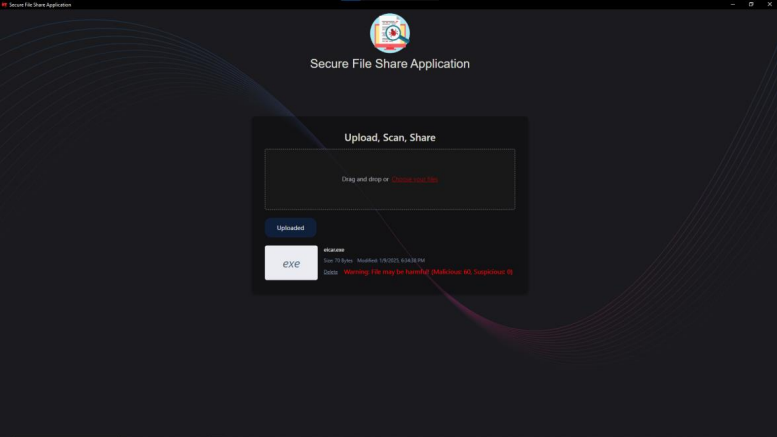

# Secure File Sharing Application 
This is a secure file sharing application that allows users to upload files, scan them for viruses, and share them securely with a password and expiry time. The application ensures that files are safe to share by integrating with the VirusTotal API for virus scanning.
## Table of Contents
- [Introduction](#introduction)
- [Key Features](#key-features)
- [Technology Used](#technology-used)
- [Hardware and Software Requirements](#hardware-and-software-requirements)
- [Backend](#backend)
    - [Setup](#setup)
    - [Endpoints](#endpoints)
- [Frontend](#frontend)
    - [Setup](#setup-1)
    - [Structure](#structure)
- [Usage](#usage)
- [Additional Information](#additional-information)

## Introduction
Secure File Sharing Application is a Desktop application that allows users to upload files, scan them for viruses, and share them securely with a password and expiry time. The application ensures that files are safe to share by integrating with the VirusTotal API for virus scanning.
 The application is built with security and user privacy in mind, ensuring that files are transmitted and stored securely. It features a modern, intuitive interface that makes file sharing simple and efficient. The integration with VirusTotal API provides comprehensive virus scanning capabilities, checking files against multiple antivirus engines.

## Key Features

- **File Upload**
    - Support for multiple file formats
    - Drag and drop functionality
    - Progress indicator during upload
    - File size limit of 100MB
    - Automatic file type detection

- **Virus Scanning**
    - Integration with VirusTotal API
    - Real-time scanning of uploaded files
    - Detection of malware, trojans, and viruses
    - Scan results from multiple antivirus engines
    - Automatic blocking of infected files

- **Secure Sharing**
    - End-to-end encryption of files
    - Custom password protection
    - Configurable expiry time for links
    - Password strength requirements
    - Share links via QR Code or copy to clipboard

- **Download Links**
    - Unique, cryptographically secure URLs
    - Single-use download options
    - Password verification before download
    - Download progress tracking
    - Automatic link expiration

- **File Expiry**
    - Automatic file deletion after expiry
    - Configurable retention policies
    - Server storage optimization
    - Secure file deletion protocol

## Technology Used
# Project Technologies

## Backend
- **Node.js**
  - **Why**: It allows for building fast and scalable server-side applications using JavaScript. Its event-driven, non-blocking I/O model makes it efficient and suitable for real-time applications.
  
- **Express.js**
  - **Why**: It simplifies the process of building web applications and APIs with Node.js by providing a robust set of features and middleware to handle HTTP requests, routing, and more.

- **MongoDB**
  - **Why**: It is a flexible, scalable NoSQL database that stores data in JSON-like documents. This makes it easy to work with and ideal for applications that require a dynamic schema.

- **Multer**
  - **Why**: It is used for handling file uploads in Node.js applications. It simplifies the process of receiving files through HTTP requests and storing them on the server.

- **Bcrypt.js**
  - **Why**: It provides a secure way to hash passwords, which is crucial for protecting user credentials in any application. It helps prevent attacks such as brute force and rainbow table attacks.

## Frontend
- **Electron**
  - **Why**: It allows for building cross-platform desktop applications using web technologies (JavaScript, HTML, and CSS). This means you can create a single codebase that runs on Windows, macOS, and Linux.

- **Tailwind CSS**
  - **Why**: It is a utility-first CSS framework that allows for rapid UI development. It provides low-level utility classes that let you build custom designs without writing custom CSS.

- **Vite**
  - **Why**: It is a modern build tool that offers a faster and leaner development experience. It provides instant server start, fast hot module replacement (HMR), and optimized builds, making the development process more efficient.

## Virus Scanning
- **VirusTotal API**
  - **Why**: It allows for integrating VirusTotal's malware scanning capabilities into your application. This enables you to analyze files and URLs for malicious content, enhancing the security of your application by detecting potential threats.

## Hardware and Software Requirements

### Hardware Requirements
- **Processor**: Intel Core i3 or equivalent
- **RAM**: 4 GB or more
- **Storage**: 500 MB of free space

### Software Requirements
- **Operating System**: Windows, macOS, or Linux
- **Node.js**: Version 14 or higher
- **MongoDB**: Version 4.4 or higher
- **Electron**: Version 31 or higher

## Backend

### Setup
1. Navigate to the Backend directory:
     ```sh
     cd backend
     ```
2. Install the dependencies:
     ```sh
     npm install
     ```
3. Start the server:
     ```sh
     npm start
     ```

### Endpoints

- **POST /upload**
    - Uploads a file with a password and expiry time.
    - **Request Body**:
        ```json
        {
            "file": "file",
            "password": "string",
            "expiryTime": "string"
        }
        ```
    - **Response**:
        ```json
        {
            "link": "string"
        }
        ```

- **GET /verify/:link**
    - Verifies the download link and prompts for a password.
    - **Response**: HTML form for password input.

- **POST /verify/:link**
    - Verifies the password for the file.
    - **Request Body**:
        ```json
        {
            "password": "string"
        }
        ```
    - **Response**:
        ```json
        {
            "valid": "boolean"
        }
        ```

- **GET /download/:link**
    - Downloads the file if the password is correct and the link is not expired.
    - **Response**: File download.

## Frontend

### Setup
1. Navigate to the Frontend directory:
     ```sh
     cd frontend
     ```
2. Install the dependencies:
     ```sh
     npm install
     ```
3. Start the development server:
     ```sh
     npm run dev
     ```

### Structure
- **Main Process**
    - `src/main/index.js`: Main Electron process.
- **Preload Script**
    - `src/preload/index.js`: Preload script for exposing APIs.
- **Renderer Process**
    - `src/renderer/index.html`: Main HTML file.
    - `src/renderer/src/renderer.js`: Main renderer script.
    - `src/renderer/src/DragAndDrop.js`: Drag and drop functionality.
    - `src/renderer/src/sendFile.js`: File sending functionality.
    - `src/renderer/assets/main.css`: Main CSS file.

## Usage
1. Open the application.
2. Drag and drop a file or choose a file to upload.
3. Set a password and expiry time.
4. Click "Upload" to upload the file.
5. Share the generated download link.

## Additional Information
- The backend uses Express.js, MongoDB, and Multer for file handling.
- The frontend uses Electron, Tailwind CSS, and Vite for development and build processes.
- The application scans files using the VirusTotal API before allowing them to be shared.


## Screenshots

### First Interface


### File Upload


### Virus Scan


### Secure Sharing


### Download Links


### Download Window


### Invalid Password


### Scan QR Code (Mobile)


### File Expiry


### Detection of Malware


